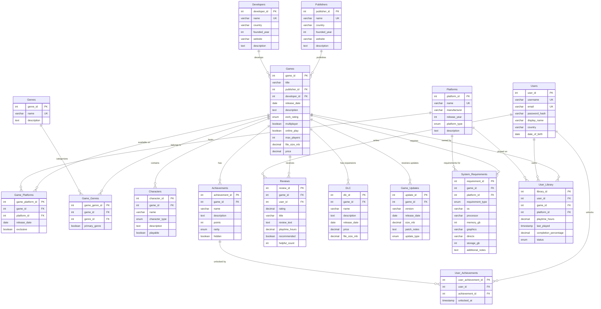

```mermaid
erDiagram
    Publishers ||--o{ Games : publishes
    Developers ||--o{ Games : develops
    Games ||--o{ Game_Platforms : "available on"
    Games ||--o{ Game_Genres : "belongs to"
    Platforms ||--o{ Game_Platforms : hosts
    Genres ||--o{ Game_Genres : categorizes
    Games ||--o{ Characters : contains
    Games ||--o{ Achievements : has
    Games ||--o{ Reviews : receives
    Games ||--o{ DLC : "has expansions"
    Games ||--o{ Game_Updates : "receives updates"
    Games ||--o{ System_Requirements : requires
    Games ||--o{ User_Library : "owned by"
    Users ||--o{ User_Library : owns
    Users ||--o{ Reviews : writes
    Users ||--o{ User_Achievements : unlocks
    Achievements ||--o{ User_Achievements : "unlocked by"
    Platforms ||--o{ User_Library : "played on"
    Platforms ||--o{ System_Requirements : "requirements for"

    Publishers {
        int publisher_id PK
        varchar name UK
        varchar country
        int founded_year
        varchar website
        text description
    }

    Developers {
        int developer_id PK
        varchar name UK
        varchar country
        int founded_year
        varchar website
        text description
    }

    Platforms {
        int platform_id PK
        varchar name UK
        varchar manufacturer
        int release_year
        enum platform_type
        text description
    }

    Genres {
        int genre_id PK
        varchar name UK
        text description
    }

    Games {
        int game_id PK
        varchar title
        int publisher_id FK
        int developer_id FK
        date release_date
        text description
        enum esrb_rating
        boolean multiplayer
        boolean online_play
        int max_players
        decimal file_size_mb
        decimal price
    }

    Game_Platforms {
        int game_platform_id PK
        int game_id FK
        int platform_id FK
        date release_date
        boolean exclusive
    }

    Game_Genres {
        int game_genre_id PK
        int game_id FK
        int genre_id FK
        boolean primary_genre
    }

    Characters {
        int character_id PK
        int game_id FK
        varchar name
        enum character_type
        text description
        boolean playable
    }

    Achievements {
        int achievement_id PK
        int game_id FK
        varchar name
        text description
        int points
        enum rarity
        boolean hidden
    }

    Users {
        int user_id PK
        varchar username UK
        varchar email UK
        varchar password_hash
        varchar display_name
        varchar country
        date date_of_birth
    }

    Reviews {
        int review_id PK
        int game_id FK
        int user_id FK
        decimal rating
        varchar title
        text review_text
        decimal playtime_hours
        boolean recommended
        int helpful_count
    }

    User_Library {
        int library_id PK
        int user_id FK
        int game_id FK
        int platform_id FK
        decimal playtime_hours
        timestamp last_played
        decimal completion_percentage
        enum status
    }

    User_Achievements {
        int user_achievement_id PK
        int user_id FK
        int achievement_id FK
        timestamp unlocked_at
    }

    DLC {
        int dlc_id PK
        int game_id FK
        varchar name
        text description
        date release_date
        decimal price
        decimal file_size_mb
    }

    Game_Updates {
        int update_id PK
        int game_id FK
        varchar version
        date release_date
        decimal size_mb
        text patch_notes
        enum update_type
    }

    System_Requirements {
        int requirement_id PK
        int game_id FK
        int platform_id FK
        enum requirement_type
        varchar os
        varchar processor
        int memory_gb
        varchar graphics
        varchar directx
        int storage_gb
        text additional_notes
    }
```
